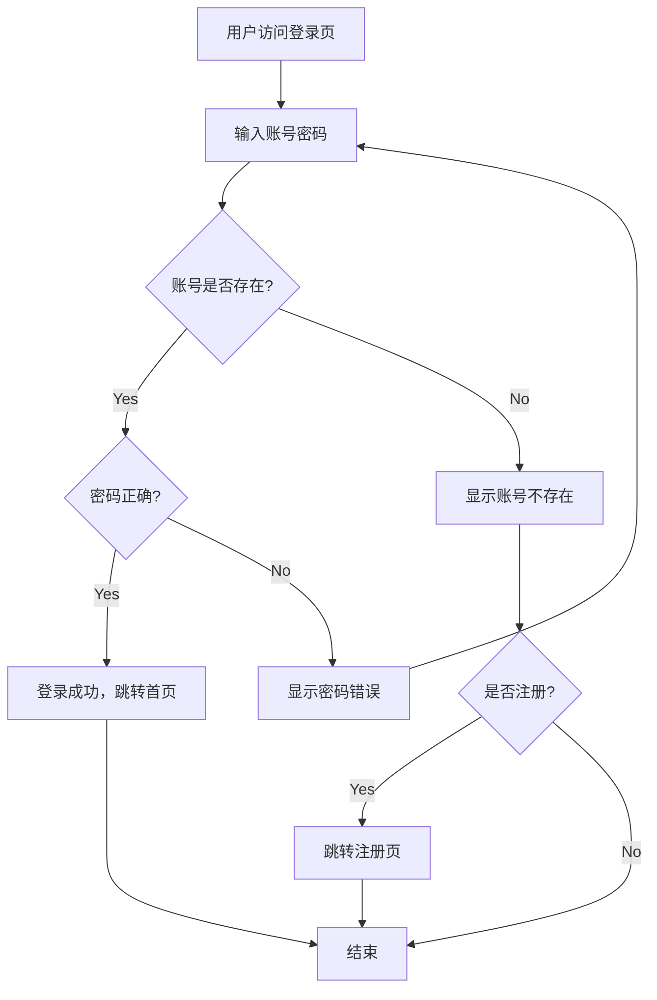

# Requirement Flowchart - 需求流程图

将 PRD 中的业务流程描述转化为可视化的 Mermaid 流程图代码。

## 触发场景

- 需要向开发团队说明复杂业务流程
- 需求评审时展示决策逻辑
- 识别流程中的异常分支和边界情况
- 设计评审时需要流程可视化

## 目录结构

```
req-flowchart/
├── SKILL.md
├── scripts/
│   └── generate-flowchart.py
└── assets/
    └── flowchart-template.md
```

## 依赖

仅使用 Python 标准库，无需额外依赖。

## 使用方法

### 方式一：从 PRD 自动提取

```bash
# 自动从 PRD 提取流程描述，生成流程图
python3 .opencode/skills/4.6-flowchart/scripts/generate-flowchart.py \
  --input "PRD.md" \
  --output "flowchart.md"
```

### 方式二：使用 DSL 描述流程

创建流程描述文件 `login-flow.txt`：

```text
START: 用户访问登录页
INPUT: 输入账号密码
DECISION: 账号是否存在?
  YES -> DECISION: 密码正确?
    YES -> ACTION: 登录成功，跳转首页 -> END
    NO -> ACTION: 显示密码错误 -> INPUT
  NO -> ACTION: 显示账号不存在 -> DECISION: 是否注册?
    YES -> ACTION: 跳转注册页 -> END
    NO -> END
```

然后运行：

```bash
python3 .opencode/skills/4.6-flowchart/scripts/generate-flowchart.py \
  --dsl "login-flow.txt" \
  --title "用户登录流程" \
  --output "login-flow.md"
```

参数：
- `--input, -i`：PRD 文件路径（方式一）
- `--dsl`：DSL 流程描述文件路径（方式二）
- `--output, -o`：输出路径，默认 `flowchart.md`
- `--title, -t`：流程图标题

## DSL 语法说明

| 关键字 | 含义 | 示例 |
|--------|------|------|
| `START` | 开始节点 | `START: 用户访问页面` |
| `END` | 结束节点 | `END` |
| `INPUT` | 输入节点 | `INPUT: 输入用户名` |
| `ACTION` | 操作节点 | `ACTION: 保存数据` |
| `DECISION` | 判断节点 | `DECISION: 是否登录?` |
| `YES ->` | 是分支 | `YES -> ACTION: 执行操作` |
| `NO ->` | 否分支 | `NO -> END` |

## 输出格式

```markdown
# 需求流程图：{标题}

## Mermaid 流程图



## 流程说明

（人工补充业务规则说明）

## 异常分支

（人工补充异常处理说明）
```

## 边界

- 支持标准的流程图元素：开始、结束、操作、判断、输入
- 暂不支持并行流程、子流程
- 自动布局依赖 Mermaid 引擎
- 复杂流程建议拆分为多个子流程图
- 流程描述需要遵循 DSL 语法规范

## 与其他 Skill 的关系

```
req-prd ──▶ req-flowchart
  PRD.md ──▶ flowchart.md
```
