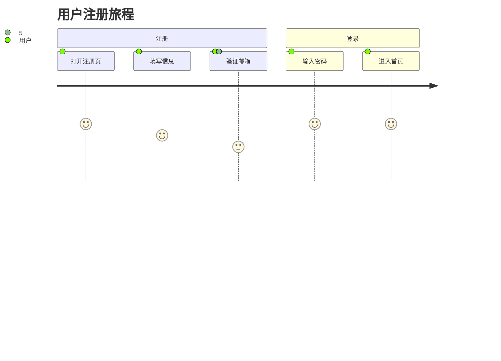

# Story Map - 用户故事地图

将 Backlog 中的用户故事按用户旅程排列，生成 Markdown 表格和 Mermaid 流程图。

## 触发场景

- Sprint 规划前，需要全局视角查看产品功能
- 向利益相关者展示产品全貌
- 识别功能缺口和优先级
- 规划发布版本（Release Planning）

## 目录结构

```
req-storymap/
├── SKILL.md
├── scripts/
│   └── generate-story-map.py
└── assets/
    └── story-map-template.md
```

## 依赖

仅使用 Python 标准库，无需额外依赖。

## 使用方法

```bash
# 基于 Backlog 生成故事地图
python3 .opencode/skills/4.5-story-map/scripts/generate-story-map.py \
  --input "backlog.md" \
  --output "story-map.md"

# 指定用户旅程阶段
python3 .opencode/skills/4.5-story-map/scripts/generate-story-map.py \
  --input "backlog.md" \
  --phases "注册,登录,使用,管理" \
  --output "story-map.md"
```

参数：
- `--input, -i`：必填，Backlog 文件路径
- `--output, -o`：可选，输出路径，默认 `story-map.md`
- `--phases, -p`：可选，自定义用户旅程阶段（逗号分隔）

## 输出格式

### Markdown 表格版（所有平台通用）

```markdown
# 用户故事地图

## 用户旅程：{旅程名称}

| 活动 | 任务 | Release 1 (MVP) | Release 2 | Release 3 |
|------|------|-----------------|-----------|-----------|
| **注册** | 创建账号 | 邮箱注册 (P0) | 手机号注册 (P1) | 社交登录 (P2) |
| **登录** | 身份认证 | 密码登录 (P0) | 扫码登录 (P2) | 指纹登录 (P3) |
| **使用** | 核心功能 | 基础功能 (P0) | 高级功能 (P1) | AI 助手 (P3) |
```

### Mermaid 图版（支持的平台自动渲染）



## 故事地图结构说明

| 维度 | 方向 | 含义 |
|------|------|------|
| **横向（X轴）** | 从左到右 | 用户完成任务的**时间顺序** |
| **纵向（Y轴）** | 从上到下 | 每个活动的**功能细化程度** |
| **切片** | 纵向列 | 一个**可发布的版本**（Release） |

## 边界

- 自动从 Backlog 识别 Epic 作为"活动"层
- Story 按优先级分配到不同 Release
- Release 划分默认为：MVP（P0）、第二轮（P1）、第三轮（P2+）
- 用户旅程阶段可自定义，默认从 Epic 名称推断
- Mermaid 语法需要平台支持才能渲染成图

## 与其他 Skill 的关系

```
4.3 需求拆解 ──▶ 4.5 故事地图
  backlog.md ──▶ story-map.md
```
