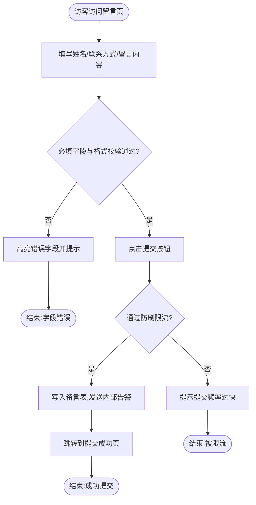

# 公司站点留言提交流程
**生成时间**: 2026-04-27  **来源**: company-site-prd.md §4.1  **整理人**: req-flowchart

## 主流程

## 流程说明
- DECISION 节点的判定逻辑详见 PRD 第 4 章功能详述
- "防刷限流" 的具体策略见 RC-001（验证码 + IP 限流）

## 待确认问题
- [ ] 字段错误后用户能否保留已填内容？默认"否"，需 PM 确认
- [ ] 限流时是否记录 IP 用于风控分析？需法务确认
