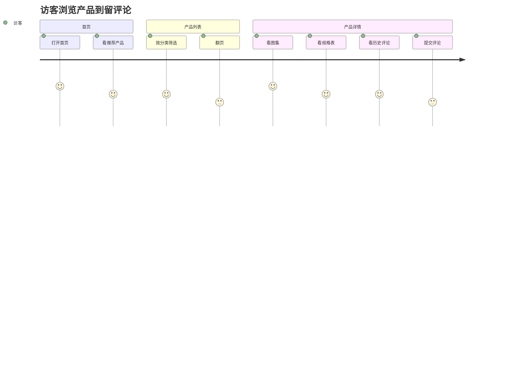
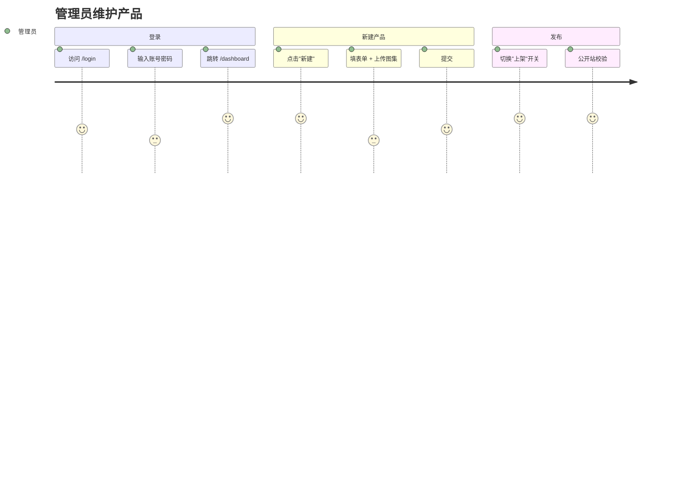
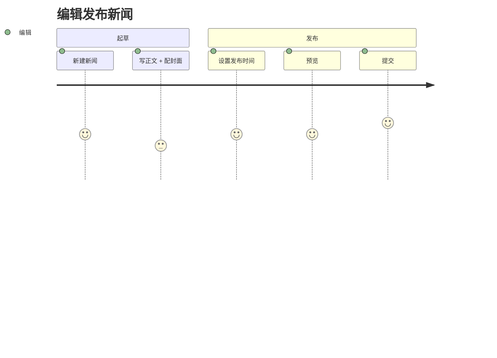

# 用户故事地图

> 来源 Skill：`req-storymap`  
> 视角：访客 / 编辑 / 管理员  
> 形式：Mermaid journey

## 关键关注点

- 访客路径里"提交评论"评分 3：因为多态字段在后台审核前不可见，访客体验上有等待感，需 UI 文案提示"评论已提交，审核后显示"。
- 管理员"填表单 + 上传图集"评分 3：图集上传单次最多 9 张，但 AI 生成的 UI 草稿未给出进度条；`design-ui-check` 已把它列入整改项。
